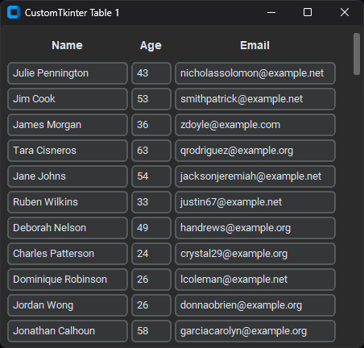
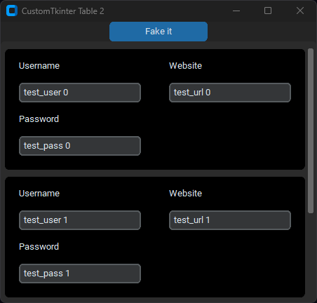
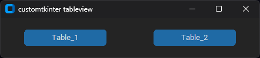

## TABLE WIDGETS FOR CUSTOMTKINTER

This repository contains two different table widgets made for customtkinter.

   

Running the main file will take you to the menu, where you can experiment with these tables.

## METHODS

### Table 1

- **add_row(row, data)** - insert data into new row
- **delete_row(row)** - delete row number
- **get_table_data()** - get all data from the table
- **update_table(data)** - update whole table with data

### Table 2

- **insert_rows(data)** - update table with data
- **clear()** - clear the whole table

## USAGE

You can find usage examples in the main files located in the 'Table_1' and 'Table_2' folders.

## Prerequisites

To run this project, you must have Python 3.x installed, along with the following modules:

`pip install customtkinter`   
`pip install faker` - to insert random data for demo purpose.

alternatively: `pip install -r requirements.txt`

## Contributing

Your contributions are welcome and appreciated!

If you encounter any issues or have suggestions for improvements, please don't hesitate to open an issue or submit a pull request on our GitHub repository.

To contribute, please follow these steps:

1. Fork the repository to your own GitHub account.
2. Clone the repository to your local machine.
3. Create a new branch for your changes.
4. Make your changes and commit them with clear commit messages.
5. Push your changes to your forked repository.
6. Open a pull request to the main repository.

## License

This app is released under the [MIT License](LICENSE). Feel free to use, modify, and distribute.